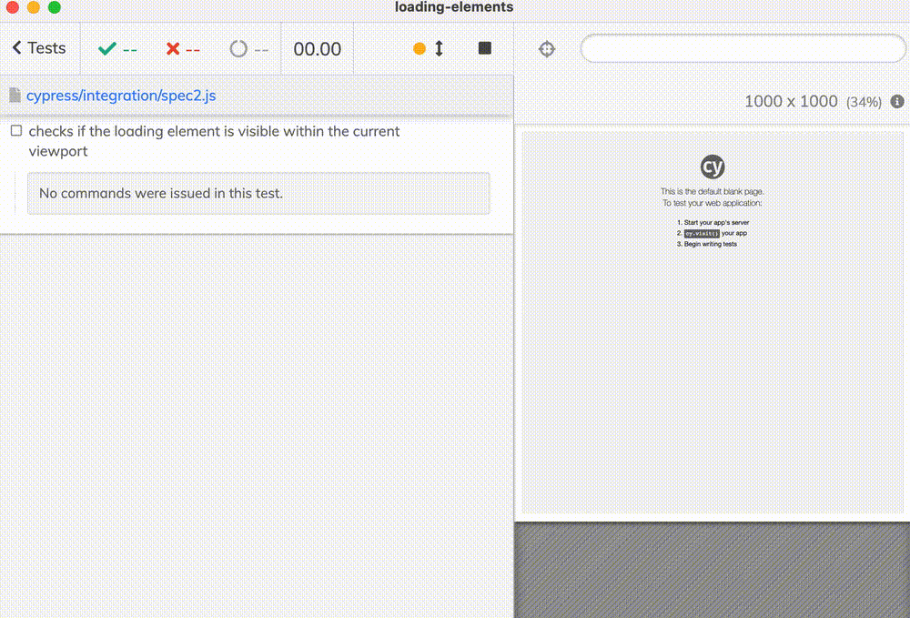

# loading-elements

> Example checking if the loading elements are visible taking into account the viewport

See the [cypress/integration/spec2.js](./cypress/integration/spec2.js)

Note: the assertion "all loading elements within the current viewport" is shown in red, but it correctly is passing. The red seems to be a Cypress bug.
